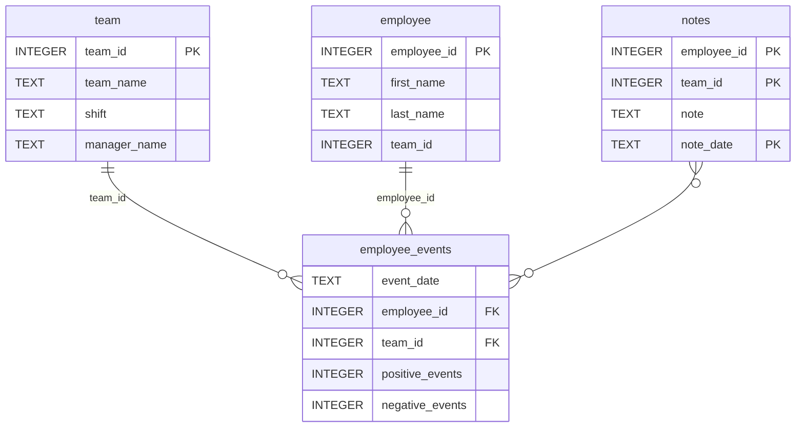

# Employee Performance Dashboard

## Project Overview

This project is an interactive employee dashboard built with FastHTML, Pandas, and Matplotlib.

The dashboard allows users to explore employee and team performance through visualizations and machine learning predictions.

### Dashboard Features

- Select either an Employee or a Team profile.
- View employee event history over time.
- Display positive and negative event trends.
- View employee notes and profile information.
- Display a machine learning prediction that estimates employee attrition risk.

### Machine Learning Prediction

The prediction chart shows the probability that an employee is at risk of leaving the company based on the trained Logistic Regression model.

## Repository Structure
```
├── README.md
├── assets
│   ├── model.pkl
│   └── report.css
├── env
├── python-package
│   ├── employee_events
│   │   ├── __init__.py
│   │   ├── employee.py
│   │   ├── employee_events.db
│   │   ├── query_base.py
│   │   ├── sql_execution.py
│   │   └── team.py
│   ├── requirements.txt
│   ├── setup.py
├── report
│   ├── base_components
│   │   ├── __init__.py
│   │   ├── base_component.py
│   │   ├── data_table.py
│   │   ├── dropdown.py
│   │   ├── matplotlib_viz.py
│   │   └── radio.py
│   ├── combined_components
│   │   ├── __init__.py
│   │   ├── combined_component.py
│   │   └── form_group.py
│   ├── dashboard.py
│   └── utils.py
├── requirements.txt
├── start
├── tests
    └── test_employee_events.py
```

## Database Schema

**Database:** `employee_events.db`



## Tools and Libraries
- Python
- pandas
- numpy
- matplotlib
- scikit-learn
- HTML
- CSS
- JSON
- Visual Studio Code
- Git

## Setup

Create a virtual environment:

```bash
python3.10 -m venv .venv
```

Activate it:

```bash
source .venv/bin/activate
```

Install dependencies:

```bash
pip install -r requirements.txt
```

Run the dashboard:

```bash
python report/dashboard.py
```

Open your browser and visit:
```bash
http://localhost:5001
```

Run the tests:

```bash
pytest
```

## References
- [Github Repository Link from Udacity](https://github.com/udacity/dsnd-dashboard-project)
- Udacity Data Scientist Nanodegree

## Author
This project was developed as part of the Udacity Data Scientist Nanodegree to demonstrate software engineering, data visualization, and machine learning concepts.
Created by Alaa Alaboud.
